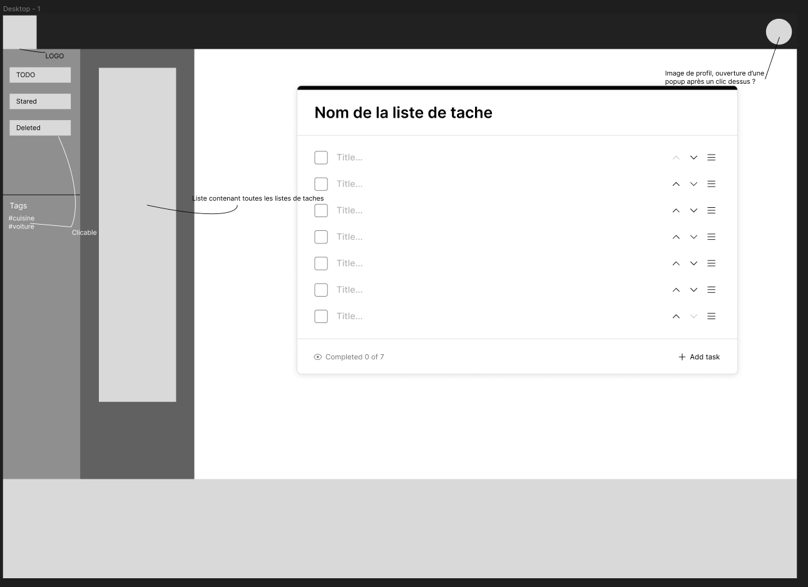

# Rapport 2 - Pour le 5 avril

# Avancement du projet
## Roles et responsabilités
**Chercheur:** Alexis Guigal  
**Chef de projet:** Niels Merceron  
**Programmeur 1:** Pierre Vermeulen  
**Programmeur 2:** Manel Azgag  

## Répartition des tâches
- **Chercheur:** 
  - Recherche et analyse des technologies
  - Rédaction du rapport 

- **Chef de projet:**  

- **Programmeur 1:**  

- **Programmeur 2:**
  
  
# Developpement du projet
## Présentation
Notre projet est un site web qui permet de gérer des todo-lists. Il permet de créer des listes de tâches, de les modifier, de les supprimer, de les partager avec d'autres utilisateurs, de les trier, de les filtrer, de les exporter, etc.  

## Objectif de la semaine
- **Organisation:** Design du site. 
- **Recherche:** Recherche spécifique sur la BDD ( SQL ou NoSQL ) + option de sécurité des BDD.
- **Code:** Front : Page d'accueil ( login/sign up ), Back : enregistrement des logs.

## Avancement cette semaine

### Schéma potentiel de notre site

# Partie Recherche et analyse
## Nécessités de la semaine
- <u>Respectez les necessités global du projet:</u> Simplicité, Documentation, *State of the art*.
- <u>Sécuriter:</u> Trouvez les meilleurs moyens de sécurisés les donneés sensible de notre SGBD.
- <u>Bonne SGBD:</u> Trouvez le SGBD qui est le mieux adapté à notre projet et qui s'adapte à l'évolution de notre site.

## Sécurité Front
Pour la sécurité de nos données sensibles côté client ( mot de passe, données privées ) nous allons utilisé une de ces bibliothèques:
- crypto-js : bibliothèque javascript.
- SubtleCrypto native dans javascipt de cryptographie.

### Hash
Pour authentifier une personne, il y aura un identifiant et un mot de passe. Ce mot de passe va être stocké haché dans la base de donnée ( hash fait coté client).
Puis quand on va se connecter à son compte on renvoie le bon identifiant et mot de passe et si l'identifiant donnée est le même que dans la base de donnée et le haché du mot de passe qu'on vient de donner est le même que celui stocké dans le SGBD alors il se connecte ( il est calculatoirement difficile de trouvé un autre mot de passe tel que son haché soit le même que celui stocké en SGBD)

Dans les bibliothèques crypto, il existe plein de fonction pour haché ( sha1 , sha3 , sha256 , md5 ...) qui vont nous permettre de haché notre mot de passe.
Dont le plus souvent utilisé le **sha256** qui sera la fonction utilisé pour haché nos mot de passe
### Encryption / Decryption
Pour stocké des données sensibles, on va les stocké cryptée pour éviter de les mettre en clair dans la base de donnée.

Dans les bibliothèques crypto, il existe plein de fonction pour crypté ( AES, DES, 3-DES) qui vont nous permettre de crypté nos donnée.

## Sécurité Back
Pour la sécurité de nos données sensibles côté serveur ( mot de passe, données privées ) nous allons utilisé:
- **bcrypt + crypto**: bibliothèque dans le nodejs d'hachage de mot de passe + crypter des messages.
- **Helmet**: Bibliothèque Express qui permet de sécurisé son site en définissant divers en-têtes HTTP
- **TLS**: Permet de sécurisé les donnée allant du client au serveur.

## Base de données
SQL ou NoSQL ? :  
Notre groupe a déjà manipulé les bases de données relationnelles utilisant le langage SQL.  
Et pour un site avec peu de fonctionnalité,et/ou avec de nombreuse jointure, une base de donnée SQL peut suffir.
Mais pour un site avec beaucoup de fonctionnalité est qui est evolutif, le NoSQL est un meilleur candidat. De plus elle permet de gerer une plus grande quantité de données tout en gérant plus facilement les sites avec un fort trafics.  
Si on reste sur du SQL, il faut être sûr qu'on ne sera pas freiner par celle ci si on fait évoluer le site.  
Ce choix s'accompagne d'autre question comme le choix du SGBD.Il faut trouver un SGBD en NoSQL qui est bien documenté pour nous permettre de faire ce que l'on a besoin.
### SQL
Malgré qu'on va continué en NoSQL, si on change d'avis entre temps on va utilisé ce SGBD :
- **PostgreSQL**:
  C'est un SGBD qui est considéré comme l'un des plus fiable et des plus avancés. Il est également connu pour offrir une excellente compatibilité avec les normes SQL, ce qui le rend très populaire parmi les développeurs. Il supporte également le langage PL:pgSQL, un langage très proche 

### NoSQL
La semaine dernière, nous hésitions entre MongoDB et Firebase. Nous avons pris la décision de ce concentré sur le SGBD MongoDB: ce SGBD est opensource et l'une des SGBD les plus utilisé ( voir le plus utilisé en NoSQL ) ce qui signifie qu'il y a beaucoup de documentation.
Alors que Firebase est propriétaire (Google) et est moins utilisé.
Voici un petit rappel de ce qu'est MongoDB:
- **MongoDB**:
  MongoDB est un système de gestion de bases de données NoSQL qui utilise un format de stockage de données basé sur JSON. Contrairement aux bases de données relationnelles, MongoDB n'utilise pas de tables et de schémas fixes, mais stocke les données dans des collections flexibles qui peuvent être modifiées sans avoir à définir un schéma préalablement. Cela permet une grande flexibilité pour gérer des données complexes et des schémas évolutifs. De plus, MongoDB offre des performances élevées, une évolutivité horizontale facile et une grande disponibilité pour les applications modernes basées sur le cloud.  
  Il est également très utilisé et la documentation est de qualité.

# Conclusion et recommandations
## Option de sécurité
Nous allons utiliser la bibliothèque crypto-js pour sécurisé les données côté client:
Cette bibliothèque est très complete: elle permet le hash et le chiffrement/déchiffrement et d'autre outils comme la personnalisation des différents chiffrement, ou de mode et de pad.
Elle est aussi très simple d'utilisation et si on a besoin, il y a beaucoup de documentation et est très utilisé. En plus de ces bibliothèques, il faut garder des reflexe de sécurité comme faire en sorte d'incité les mot de pass sécurisé, ainsi que d'éviter les attaques par force brute par exemple en limitant le nombre de fois qu'on met un mot de passe où avec un algorithme de hachage assez lents.

Pour les données côté serveur, comme dit avant, nous allons utilisé des protocols/bibliothèque : bcrypt + crypto, TLS, Helmet. De plus que ça, il faut prendre quelque reflexe comme sécurisé les cookies où éviter les attaques par force brute.
Pour le hachage, il faut absolument hacher côté client et côté serveur pour eviter les attaques dans le canal entre client et serveur( utilisation du hachage pour ce connecté, connaissance du clair).
## SQL ou NoSQL
Nous allons donc opter pour un SGBD NoSQL malgré le fait qu'on ai plus pratiqué le SGBD relationnel. Cependant le NoSQL est plus adapté et plus le projet évoluera, plus le NoSQL deviendra une évidence.
## Choix du SGBD
Nous allons donc choisir MongoDB pour avoir une SGBD qui sera le plus rapide à prendre en main grâce à sa documentation. De plus, si c'est l'un des plus utilisé, c'est qu'il marche bien en plus d'être open-source.

# Sources
## Bibliothèque crypto front
https://www.npmjs.com/package/crypto-js  
https://openbase.com/js/crypto-js  
https://www.makeuseof.com/nodejs-bcrypt-hash-verify-salt-password/ 
https://nodejs.org/api/crypto.html  
https://www.npmjs.com/package/bcrypt   
https://developer.mozilla.org/fr/docs/Web/API/SubtleCrypto  
https://qwtel.com/posts/software/replacing-cryptojs-with-web-cryptography/  

## Bibliothèque/protocol back + prevention
https://expressjs.com/en/advanced/best-practice-security.html#use-cookies-securely  
https://helmetjs.github.io/  
https://www.npmjs.com/package/helmet  
https://www.securecoding.com/blog/javascript-as-backend-prone-to-security-risks/  
https://fr.wikipedia.org/wiki/Transport_Layer_Security  
https://advancedweb.hu/how-to-hash-passwords-and-when-not-to/  

## SQL ou NoSQL
https://datascientest.com/sql-vs-nosql-differences-utilisations-avantages-et-inconvenients  
https://datascientest.com/nosql-tout-savoir  
https://www.ibm.com/cloud/blog/sql-vs-nosql  
https://www.mongodb.com/nosql-explained/nosql-vs-sql  

## MongoDB

https://db-engines.com/en/ranking  
https://firebase.google.com/docs?gclid=Cj0KCQjwz6ShBhCMARIsAH9A0qU-LK33rpJLKXeFM4Uvqqk9LKAwSEpBFgKyclnm1G4hfhB2OQpL3fAaAs4OEALw_wcB&gclsrc=aw.ds&hl=fr  
https://www.mongodb.com/fr-fr  
https://fr.wikipedia.org/wiki/MongoDB  
  
### Tuto MongoDB
https://harry-wanki.developpez.com/tutoriels/mongodb/debuter-mongodb-introduction-base-donnees-nosql/#LIII  
https://www.fil.univ-lille.fr/~routier/enseignement/licence/jsfs/html/node-mongodb.html

